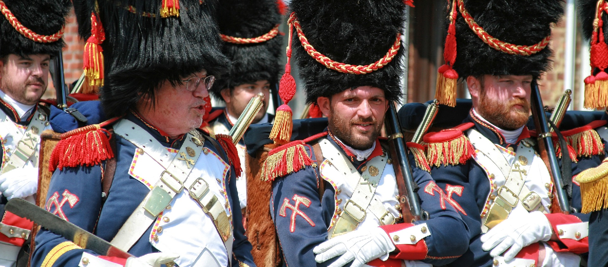

# Store the wargame
 

 

### Créer functions et procédures pour prendre en compte les évolutions demandées.

## Ressource(s)
 

 

## Contexte du projet

Une association de fans de wargame vétérans (jeu de figurine) vous demande de modifier leur application qui permet de détenir une trace des différentes armées des joueurs. Elle permet également de voir quels joueurs ont accumulé le plus de victoires.

L'application est un peu datée, il s'agit d'un front desktop en java Swing qui a connu des jours meilleurs et doit dater de la toute  fin des années 90 lorsque l'association a été créée. L'application consomme directement une base de données installée sur un serveur dans le local à café. Vous avez accès à cette base de données apparemment plus récente, installée par un proche d'un membre de l'association.

L'application desktop sera modifiée par le neveu d'un membre. Le public n'étant pas tout jeune, il s'oppose à une refonte ou une modernisation de l'application.

Le neveu demande trois nouvelles fonctionnalités.

<ul>
<li>
créer une fonction qui donne directement les utilisateurs en ajoutant un boolean s'ils sont spectateurs
</li>
<li>
permettre d'afficher directement une armée et les types d'unité qui la compose, avec la possibilité de faire des tris dessus (etc...)
</li>
<li>
lorsqu'un utilisateur quitte l'association, supprimer ses données mais insérer son surnom et son nombre de victoires dans la table des victoires.
</li>
</ul>

## Modalités pédagogiques

individuel

## Critères de performance

Les inputs sont controlés, des exceptions sont renvoyées en cas d'erreur.

## Modalités d'évaluation

Code SQL

## Livrables

code sql + résultats

